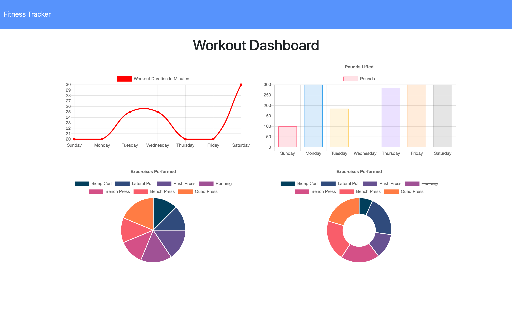

# gt-hw-workout-tracker


## Description


## Table of Contents

* [Preview](#preview)

* [Installation](#installation)

* [Usage](#usage)

* [License](#license)

* [Contributing](#contributing)

* [Tests](#tests)

* [Questions](#questions)

## Preview




## Installation

To install necessary dependencies, run the following command:

```
npm install
```

## Usage

* Clone/fork repo and install the necessary dependencies. Run the server with `npm start` and view application in your browser at `http://localhost:3000`.

* View deployed app on [heroku](https://workout-tracker-jrp.herokuapp.com/).

## License

This project is licensed under the MIT license.

## Contributing

Other than the files given to me by Georgia Tech, I am the sole contibutor.

## Questions

If you have any questions about the repo, open an issue or contact me directly at jaredp17@me.com. You can find more of my work at [jaredp17](https://github.com/jaredp17/).